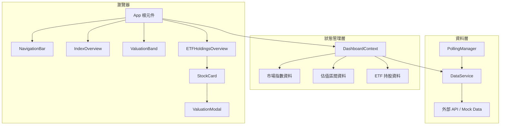
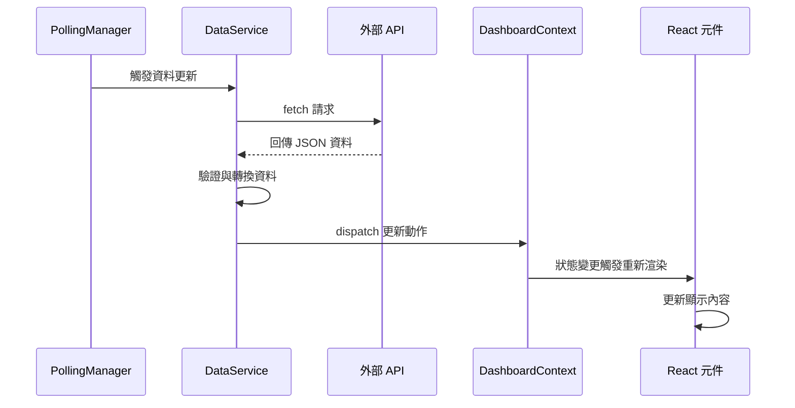

# 技術設計文件：台股價值投資儀表板

## 概述

本設計文件描述台股價值投資儀表板的技術架構與實作方案。此應用為一個單頁式網頁應用程式（SPA），採用 React + TypeScript 技術棧，以深色主題呈現全球市場指數、台股估值區間、ETF 成分股總覽及個股估值分析。

技術選型：
- **前端框架**：React 18 + TypeScript
- **建置工具**：Vite
- **狀態管理**：React Context + useReducer（應用規模適中，無需引入 Redux）
- **樣式方案**：CSS Modules + CSS Custom Properties（深色主題變數管理）
- **資料取得**：自訂 Hook 封裝 fetch API，搭配定時輪詢機制
- **測試框架**：Vitest + fast-check（屬性測試）
- **圖表/視覺化**：純 CSS 漸層實作估值色條

設計決策理由：
1. 選用 Vite 而非 CRA，因其更快的開發體驗與更小的打包體積
2. 使用 CSS Modules 而非 CSS-in-JS，避免執行期效能開銷，且深色主題透過 CSS Custom Properties 統一管理
3. 不引入額外狀態管理庫，因資料流單純（API → 全域狀態 → 元件渲染）
4. 使用 fast-check 作為屬性測試庫，它是 JavaScript/TypeScript 生態中最成熟的 PBT 框架

## 架構

### 系統架構圖



### 資料流架構



### 目錄結構

```
src/
├── components/
│   ├── NavigationBar/
│   │   ├── NavigationBar.tsx
│   │   └── NavigationBar.module.css
│   ├── IndexOverview/
│   │   ├── IndexOverview.tsx
│   │   ├── IndexCard.tsx
│   │   └── IndexOverview.module.css
│   ├── ValuationBand/
│   │   ├── ValuationBand.tsx
│   │   └── ValuationBand.module.css
│   ├── ETFHoldings/
│   │   ├── ETFHoldingsOverview.tsx
│   │   ├── StockCard.tsx
│   │   └── ETFHoldings.module.css
│   └── ValuationModal/
│       ├── ValuationModal.tsx
│       └── ValuationModal.module.css
├── context/
│   └── DashboardContext.tsx
├── services/
│   ├── dataService.ts
│   └── pollingManager.ts
├── types/
│   └── index.ts
├── utils/
│   ├── formatting.ts
│   ├── valuation.ts
│   └── colors.ts
├── App.tsx
├── App.module.css
└── main.tsx
```


## 元件與介面

### 1. NavigationBar 元件

負責顯示品牌名稱、最後更新時間、設定與登入按鈕。

```typescript
interface NavigationBarProps {
  lastUpdatedTime: Date | null;
  onSettingsClick: () => void;
  onLoginClick: () => void;
}
```

行為：
- 品牌名稱固定顯示「股市看板」
- 更新時間格式化為「更新 上午/下午 HH:MM:SS」（使用 `Intl.DateTimeFormat` 搭配 `zh-TW` locale）
- 設定與登入按鈕觸發對應回呼函式

### 2. IndexOverview 元件

水平可捲動的指數卡片列，顯示九項全球市場指數。

```typescript
interface IndexOverviewProps {
  indices: MarketIndex[];
}
```

子元件 `IndexCard`：

```typescript
interface IndexCardProps {
  index: MarketIndex;
}
```

行為：
- 以 CSS `overflow-x: auto` 實現水平捲動
- 每張卡片顯示：名稱、數值、漲跌點數、漲跌百分比、更新日期
- 漲跌正值紅色、負值綠色（台股慣例）
- 特殊指標顯示額外語意標籤

### 3. ValuationBand 元件

台股加權指數估值區間表格。

```typescript
interface ValuationBandProps {
  currentIndex: number;
  yearlyChange: number;
  yearlyAverage: number;
  bands: ValuationLevel[];
}
```

行為：
- 水平表格顯示八個估值等級
- 每格顯示：進場比例、等級名稱、乖離率、對應指數點位
- 使用顏色漸層區分等級（深綠→淺綠→黃→橙→紅）
- 箭頭標記目前指數所處位置

### 4. ETFHoldingsOverview 元件

ETF 成分股總覽區域，含切換與篩選功能。

```typescript
interface ETFHoldingsOverviewProps {
  availableETFs: string[];
  selectedETF: string;
  onETFChange: (etfCode: string) => void;
  timePeriod: TimePeriod;
  onTimePeriodChange: (period: TimePeriod) => void;
  holdings: StockHolding[];
  filter: HoldingsFilter;
  onFilterChange: (filter: HoldingsFilter) => void;
}
```

子元件 `StockCard`：

```typescript
interface StockCardProps {
  stock: StockHolding;
  onClick: (stockCode: string) => void;
}
```

行為：
- 時間週期切換：日/週/月
- ETF 代碼標籤列切換
- 篩選按鈕：熱門、漲停、跌停
- 狀態指示：買入中、上漲、下跌
- 網格排列，每列 4-5 張卡片（響應式）

### 5. ValuationModal 元件

個股詳細估值彈窗。

```typescript
interface ValuationModalProps {
  stock: StockDetail;
  onClose: () => void;
}
```

行為：
- 顯示基本資訊：名稱、代碼、交易所、最新股價、漲跌、市值、預估 EPS、估值狀態
- 六級估值表格：特價、便宜、合理、偏高、昂貴、瘋狂
- 每級顯示本益比倍數與目標股價（= 預估 EPS × 本益比）
- 漸層色條（綠→黃→紅）標示目前股價位置
- 點擊外部區域或關閉按鈕關閉彈窗

### 6. DashboardContext 狀態管理

```typescript
interface DashboardState {
  marketIndices: MarketIndex[];
  taiexValuation: TaiexValuation | null;
  etfHoldings: Map<string, StockHolding[]>;
  selectedETF: string;
  timePeriod: TimePeriod;
  holdingsFilter: HoldingsFilter;
  lastUpdatedTime: Date | null;
  isLoading: boolean;
  error: string | null;
}

type DashboardAction =
  | { type: 'SET_MARKET_INDICES'; payload: MarketIndex[] }
  | { type: 'SET_TAIEX_VALUATION'; payload: TaiexValuation }
  | { type: 'SET_ETF_HOLDINGS'; payload: { etfCode: string; holdings: StockHolding[] } }
  | { type: 'SET_SELECTED_ETF'; payload: string }
  | { type: 'SET_TIME_PERIOD'; payload: TimePeriod }
  | { type: 'SET_HOLDINGS_FILTER'; payload: HoldingsFilter }
  | { type: 'SET_LAST_UPDATED'; payload: Date }
  | { type: 'SET_LOADING'; payload: boolean }
  | { type: 'SET_ERROR'; payload: string | null };
```

### 7. DataService 資料服務

```typescript
interface DataService {
  fetchMarketIndices(): Promise<MarketIndex[]>;
  fetchTaiexValuation(): Promise<TaiexValuation>;
  fetchETFHoldings(etfCode: string): Promise<StockHolding[]>;
  fetchStockDetail(stockCode: string): Promise<StockDetail>;
}
```

### 8. PollingManager 輪詢管理

```typescript
interface PollingManager {
  start(intervalMs: number): void;
  stop(): void;
  onUpdate(callback: () => void): void;
  onError(callback: (error: Error) => void): void;
}
```

行為：
- 以 `setInterval` 定期觸發資料更新
- 元件卸載時自動清除計時器
- 錯誤時保留最後成功資料，顯示錯誤提示


## 資料模型

### 核心型別定義

```typescript
// 時間週期
type TimePeriod = 'daily' | 'weekly' | 'monthly';

// 持股篩選條件
type HoldingsFilter = 'all' | 'hot' | 'limit_up' | 'limit_down';

// 估值等級名稱
type ValuationLevelName =
  | 'panic'      // 恐慌
  | 'crash'      // 崩跌
  | 'bargain'    // 特價
  | 'cheap'      // 便宜
  | 'fair'       // 合理
  | 'overpriced' // 偏高
  | 'expensive'  // 昂貴
  | 'crazy';     // 瘋狂

// 股票估值狀態
type StockValuationStatus = 'bargain' | 'cheap' | 'fair' | 'overpriced' | 'expensive' | 'crazy';

// 市場指數
interface MarketIndex {
  id: string;
  name: string;
  value: number;
  change: number;
  changePercent: number;
  updatedDate: string;
  semanticLabel?: string; // 例如「偏空」、「極度恐懼」
}

// 估值等級
interface ValuationLevel {
  name: ValuationLevelName;
  displayName: string;       // 中文顯示名稱
  entryRatio: number;        // 進場比例 (0-100)
  deviationRate: number;     // 乖離率百分比
  indexValue: number;         // 對應指數點位
  color: string;             // 等級顏色
}

// 台股加權指數估值
interface TaiexValuation {
  currentIndex: number;
  yearlyChangePercent: number;
  yearlyAverage: number;
  currentLevel: ValuationLevelName;
  bands: ValuationLevel[];
}

// ETF 成分股持股
interface StockHolding {
  stockCode: string;
  stockName: string;
  currentPrice: number;
  priceChange: number;
  changePercent: number;
  eps: number;
  valuationStatus: StockValuationStatus;
}

// 個股詳細資訊
interface StockDetail {
  stockCode: string;
  stockName: string;
  exchange: string;
  currentPrice: number;
  priceChange: number;
  changePercent: number;
  marketCap: number;
  estimatedEPS: number;
  estimatedYear: number;
  valuationStatus: StockValuationStatus;
  peRatios: PERatioLevel[];
}

// 本益比等級
interface PERatioLevel {
  level: StockValuationStatus;
  displayName: string;
  peRatio: number;
  targetPrice: number; // = estimatedEPS * peRatio
}
```

### 估值等級預設配置

```typescript
const VALUATION_BAND_CONFIG: Record<ValuationLevelName, {
  displayName: string;
  entryRatio: number;
  color: string;
}> = {
  panic:      { displayName: '恐慌', entryRatio: 100, color: '#1b5e20' },
  crash:      { displayName: '崩跌', entryRatio: 100, color: '#2e7d32' },
  bargain:    { displayName: '特價', entryRatio: 100, color: '#388e3c' },
  cheap:      { displayName: '便宜', entryRatio: 100, color: '#66bb6a' },
  fair:       { displayName: '合理', entryRatio: 70,  color: '#fdd835' },
  overpriced: { displayName: '偏高', entryRatio: 50,  color: '#ff9800' },
  expensive:  { displayName: '昂貴', entryRatio: 30,  color: '#f44336' },
  crazy:      { displayName: '瘋狂', entryRatio: 10,  color: '#b71c1c' },
};
```

### ETF 代碼清單

```typescript
const AVAILABLE_ETFS = [
  '0059', '0051', '0052', '0053', '0056',
  '00878', '00919', '00929', '00940'
] as const;
```

### CSS 主題變數

```css
:root {
  /* 背景色 */
  --bg-primary: #1a1a2e;
  --bg-card: #16213e;
  --bg-card-hover: #1a2744;

  /* 文字色 */
  --text-primary: #e0e0e0;
  --text-secondary: #a0a0a0;
  --text-muted: #666666;

  /* 台股慣例色 */
  --color-up: #ff4444;
  --color-down: #00c853;
  --color-neutral: #a0a0a0;

  /* 品牌色 */
  --color-brand: #4caf50;

  /* 估值色階 */
  --valuation-panic: #1b5e20;
  --valuation-crash: #2e7d32;
  --valuation-bargain: #388e3c;
  --valuation-cheap: #66bb6a;
  --valuation-fair: #fdd835;
  --valuation-overpriced: #ff9800;
  --valuation-expensive: #f44336;
  --valuation-crazy: #b71c1c;

  /* 字體 */
  --font-zh: 'Noto Sans TC', 'Microsoft JhengHei', sans-serif;
  --font-mono: 'JetBrains Mono', 'Fira Code', monospace;

  /* 間距 */
  --spacing-xs: 4px;
  --spacing-sm: 8px;
  --spacing-md: 16px;
  --spacing-lg: 24px;
  --spacing-xl: 32px;

  /* 圓角 */
  --radius-sm: 4px;
  --radius-md: 8px;
  --radius-lg: 12px;
}
```

